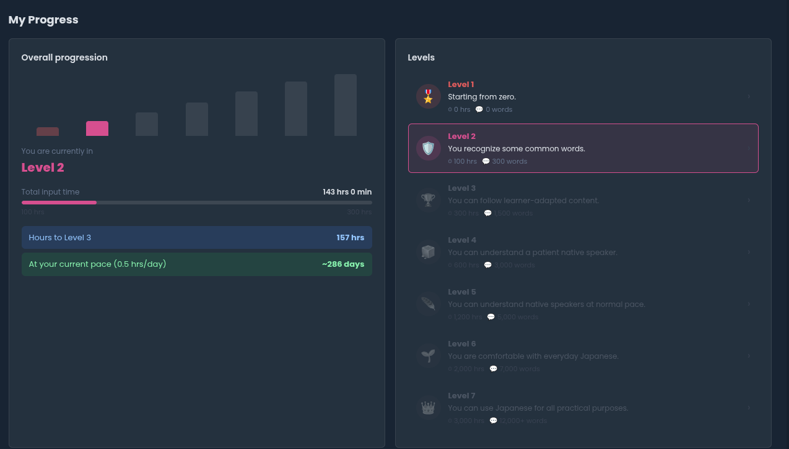

# cijapanese-progress

A userscript for [cijapanese.com](https://cijapanese.com) that adds a progress dashboard to the dashboard page, inspired by Dreaming Spanish's level system.

## What it does

Shows a 7-level progression system based on your total input hours (calibrated for Japanese, roughly 2× the hours of Spanish). Includes a bar chart of your current level, a progress bar toward the next level, a daily pace estimate, and clickable level cards with detailed breakdowns of what you can do, what to focus on, and what you're acquiring at each stage.

## Usage

Paste `cijapanese-progress.js` into [cijapanese.com/userscripts](https://cijapanese.com/userscripts).
